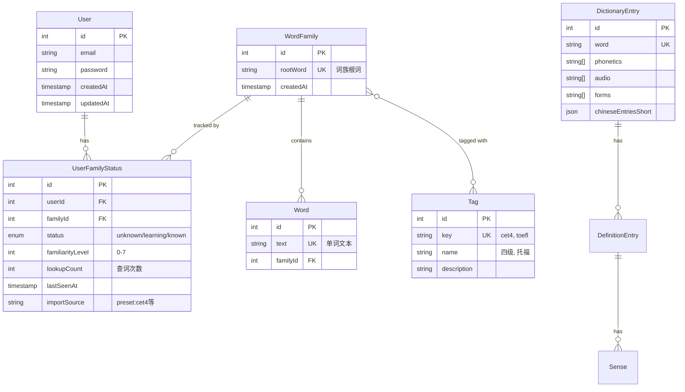

# LinguoLand 项目架构分析报告

> 生成时间: 2025-01-21
> 项目版本: v0.2.4

## 📋 目录

- [项目概述](#项目概述)
- [技术栈](#技术栈)
- [架构设计](#架构设计)
- [核心功能](#核心功能)
- [发现的问题](#发现的问题)
- [优化建议](#优化建议)
- [前进方向建议](#前进方向建议)

---

## 项目概述

**LinguoLand** 是一个智能英语学习助手 Chrome 扩展，通过在网页上智能高亮英文单词，结合词典查询、AI 增强解释、词汇管理等功能，帮助用户在日常浏览中学习英语。

### 核心价值

- 📖 **沉浸式学习**：在任何英文网页上自动高亮生词，无需切换界面
- 🧠 **智能词族管理**：基于词族（word family）概念管理词汇，`invade/invasion/invasive` 作为一个整体
- 🤖 **AI 增强**：集成阿里云 DashScope，提供上下文相关的释义和翻译
- 📊 **学习追踪**：熟练度系统（0-7 级）+ 查词次数统计

---

## 技术栈

### Monorepo 管理

```yaml
包管理器: pnpm (v10.15.1)
构建工具: Turbo (v2.5.6)
Workspace:
  - apps/extension    # Chrome 扩展
  - apps/server       # NestJS 后端
  - apps/admin        # Next.js 管理后台
  - apps/docs         # Docusaurus 文档
  - packages/shared-types  # 共享类型定义
```

### 前端技术栈

| 应用 | 框架 | 特点 |
|------|------|------|
| **Extension** | React 19 + Vite | 多入口构建（content/background/popup/options） |
| **Admin** | Next.js 15 | 管理后台（当前基本未实现） |
| **Docs** | Docusaurus | 用户文档 |

**UI 组件库**: shadcn/ui + Radix UI + Tailwind CSS v4

**特殊技术**:
- Shadow DOM 隔离（避免样式冲突）
- CSS Custom Highlight API（性能优化的高亮方案）
- Chrome Extension Manifest V3

### 后端技术栈

```typescript
框架: NestJS (v11.0)
数据库: PostgreSQL
ORM: Prisma (v6.16)
认证: JWT (Passport)
AI 服务: 阿里云 DashScope (qwen-flash 模型)
```

### 工具链

- **代码质量**: ESLint + Prettier
- **测试**: Vitest (extension)
- **版本管理**: bumpp (自动版本管理)
- **容器化**: Docker Compose (数据库)

---

## 架构设计

### 整体架构图

```
┌─────────────────────────────────────────────────────────────┐
│                      浏览器（Chrome）                         │
│  ┌──────────────┐  ┌──────────────┐  ┌──────────────┐      │
│  │ Content      │  │ Background   │  │ Popup/       │      │
│  │ Script       │◄─┤ Service      │◄─┤ Options      │      │
│  │ (页面高亮)   │  │ Worker       │  │ (管理界面)   │      │
│  └──────┬───────┘  └──────┬───────┘  └──────────────┘      │
│         │                  │                                  │
└─────────┼──────────────────┼──────────────────────────────────┘
          │                  │
          │            ┌─────▼──────┐
          │            │  NestJS    │
          │            │  Server    │
          │            │  (3000)    │
          │            └─────┬──────┘
          │                  │
          │       ┌──────────┼──────────┐
          │       │          │          │
          │   ┌───▼───┐  ┌──▼───┐  ┌──▼────┐
          │   │Prisma │  │JWT   │  │AI API │
          │   │ORM    │  │Auth  │  │       │
          │   └───┬───┘  └──────┘  └───────┘
          │       │
          │   ┌───▼────────┐
          │   │PostgreSQL  │
          │   │(词族/词典)│
          │   └────────────┘
          │
     ┌────▼─────┐
     │Shadow DOM│
     │WordCard  │
     └──────────┘
```

### 数据模型设计

#### 核心实体关系（Prisma Schema）



**设计亮点**：

1. **词族管理**：将 `running/runs/ran` 等变体统一到 `run` 词族，避免重复学习
2. **标签系统**：支持 CET4/CET6/TOEFL 等预设词库标签
3. **熟练度分级**：0-7 级精细化追踪（vs 传统的陌生/学习中/已掌握）
4. **来源追踪**：区分手动添加 vs 预设导入，便于管理

---

## 核心功能

### 1. 智能高亮系统

**实现路径**: `apps/extension/src/content/`

```typescript
// 核心流程
1. 页面扫描 → 2. 词元化(Lemmatization) → 3. 状态查询 → 4. 创建高亮
```

**技术细节**：

- **文本处理**：使用 `compromise.js` 进行词元还原
- **高亮渲染**：优先使用 CSS Custom Highlight API（性能更优），降级到 CSS 类名方案
- **增量扫描**：监听 DOM 变化（MutationObserver），只处理新增节点
- **字幕优化**：针对 YouTube 等视频网站字幕做特殊优化（100ms debounce）

**已解决的性能问题**：

- ✅ 避免重复高亮
- ✅ 批量查询单词状态（减少 API 调用）
- ✅ 忽略技术术语（如 `app-drawer-button` 不拆分）

### 2. 单词卡片系统

**实现路径**: `apps/extension/src/content-ui/WordCard.tsx`

**展示内容**：

```yaml
基础信息:
  - 原始单词 (点击时的单词)
  - 词元 (lemma)
  - 词族根词 (familyRoot) # 蓝色标识
  - 音标 + 发音

词典内容:
  - 词性 + 释义 (多词性分组)
  - 标签 (CET4/TOEFL 等)

AI 增强:
  - 上下文释义 (Markdown 格式)
  - 例句
  - 同义词

交互功能:
  - 状态切换: 陌生 / 学习中 / 已掌握
  - 熟练度滑块: 0-7 级
  - 忽略按钮
```

**技术亮点**：

- 使用 Shadow DOM 隔离，避免页面样式污染
- 支持 AI 流式输出（逐字显示）
- 自动提升熟练度（可选功能）

### 3. 词汇管理

**前端**: `apps/extension/src/options/Options.tsx`

**后端 API**: `apps/server/src/vocabulary.controller.ts`

**功能清单**：

| 功能 | 端点 | 说明 |
|------|------|------|
| 查询词汇列表 | GET /api/v1/vocabulary | 支持分页、排序、筛选 |
| 导入预设词库 | POST /api/v1/vocabulary/preset/:key | CET4/CET6/COCA 等 |
| 导出词汇 | GET /api/v1/vocabulary/export | JSON/TXT/JSON Array |
| 导入词汇 | POST /api/v1/vocabulary/import | JSON 格式 |
| 获取统计 | GET /api/v1/vocabulary/stats | 学习统计 |
| 批量操作 | POST /api/v1/vocabulary/batch-update | 批量标记为已掌握/忽略 |

**预设词库**：

```
apps/server/src/data/
├── junior_high.json      # 初中词汇
├── high.json            # 高中词汇
├── cet_4.json           # 大学英语四级
├── cet_6.json           # 大学英语六级
└── coca20000.json       # COCA 常用 20000 词
```

### 4. AI 增强功能

**实现路径**: `apps/server/src/ai/ai.service.ts`

**使用模型**: 阿里云 DashScope (qwen-flash)

**支持功能**：

1. **上下文释义**
   - 根据句子上下文解释单词
   - 支持短语检测（如 `take off` 而非只解释 `take`）

2. **句子翻译**
   - 段落翻译
   - 可选长难句分析（always/smart/off）

3. **词典补充**
   - 为缺失的单词生成中文释义

**配置项**：

```typescript
// .env 文件
DASHSCOPE_API_KEY=sk-xxx...
```

---

## 发现的问题

### 🔴 架构层面

#### 1. **Admin 应用基本空白**

**现状**：
```typescript
// apps/admin/app/page.tsx
export default function Home() {
  return <div>Admin Dashboard</div>;
}
```

**影响**：
- 缺少用户管理界面
- 无法查看全局统计数据
- 词库管理依赖命令行

**优先级**: 中 🟡

---

#### 2. **shared-types 包职责不清晰**

**现状**：
```typescript
// packages/shared-types/index.ts
// 混合了类型定义和 Chrome 消息定义
```

**问题**：
- Extension 特有的 Chrome 消息类型不应在 shared-types 中
- 缺少 shared 的业务逻辑（如词元化工具）

**建议**：重构为多个包：
```
packages/
├── shared-types/       # 纯业务类型
├── shared-utils/       # 共享工具函数
└── extension-types/    # 扩展专用类型
```

**优先级**: 低 🟢

---

#### 3. **缺少 E2E 测试**

**现状**：
- Extension 有部分单元测试（Vitest）
- Server 没有测试
- 没有端到端测试

**风险**：
- 关键功能（如词族查询、状态更新）容易出 bug
- 重构时缺乏信心

**优先级**: 高 🔴

---

### 🔴 代码质量

#### 4. **前端代码重复较多**

**示例问题**：
```typescript
// 多个地方都有类似的 chrome.storage 读写逻辑
// settingsManager.ts
// wordCardManager.ts
// content.ts
```

**建议**：抽象统一的 Storage Service

**优先级**: 中 🟡

---

#### 5. **Logger 使用不一致**

**现状**：
- Extension 有 Logger 类 (`utils/logger.ts`)
- 部分文件使用 `console.log`
- Server 使用 NestJS Logger

**建议**：统一 Logging 规范和格式

**优先级**: 低 🟢

---

#### 6. **Error Handling 不够完善**

**问题点**：
- AI 服务调用失败时用户体验差
- 网络错误缺少重试机制
- 部分异步操作未捕获异常

**优先级**: 中 🟡

---

### 🔴 性能与体验

#### 7. **首次加载词典数据较慢**

**现状**：
```typescript
// dictionary.json (6万词条) 需要一次性加载
await dictionaryLoader.initialize();
```

**影响**：首屏高亮延迟 1-2 秒

**建议**：
- 词典数据分片加载
- 使用 IndexedDB 缓存
- 考虑 WebWorker 异步加载

**优先级**: 高 🔴

---

#### 8. **AI 流式输出体验可优化**

**现状**：流式输出已实现，但：
- 缺少 Loading 状态
- 失败重试不友好
- Token 使用量未展示

**优先级**: 中 🟡

---

#### 9. **移动端适配缺失**

**现状**：
- WordCard UI 未针对小屏幕优化
- Options 页面在移动设备上布局错乱

**优先级**: 低 🟢（Chrome 扩展主要用于桌面端）

---

### 🔴 数据与安全

#### 10. **用户认证机制简单**

**现状**：
```typescript
// JWT 认证，但：
- 缺少 Refresh Token 机制
- 密码存储使用 bcrypt（好的）
- 缺少速率限制
- 缺少邮箱验证
```

**风险**：
- Token 过期后需要重新登录
- 容易被暴力破解

**优先级**: 高 🔴

---

#### 11. **敏感信息暴露风险**

**问题**：
```typescript
// public/manifest.json
"host_permissions": [
  "http://localhost:3000/*",
  "http://www.xxih.cc/*"  // ⚠️ 生产域名硬编码
]
```

**建议**：
- 使用环境变量管理
- 构建时动态注入

**优先级**: 高 🔴

---

#### 12. **缺少数据备份机制**

**现状**：
- 用户词汇数据只存在 PostgreSQL
- 导出功能存在，但缺少自动备份

**建议**：
- 自动云端同步
- 定期备份提醒

**优先级**: 中 🟡

---

### 🔴 运维与部署

#### 13. **缺少 CI/CD Pipeline**

**现状**：手动构建和发布

**建议**：
```yaml
# .github/workflows/ci.yml
- 自动化测试
- 自动构建 Extension
- 自动部署 Server (Docker)
- 自动发布文档
```

**优先级**: 中 🟡

---

#### 14. **环境配置管理混乱**

**问题**：
```
- Server 使用 .env
- Extension 构建时硬编码 API 地址
- 缺少统一的环境变量管理
```

**建议**：
- 引入 `dotenv-cli` 或 `env-cmd`
- 统一管理 dev/staging/prod 环境

**优先级**: 中 🟡

---

#### 15. **Docker 配置不完整**

**现状**：
```yaml
# docker-compose.yml 只有 PostgreSQL
```

**建议**：增加：
```yaml
services:
  postgres:  # 已有
  server:    # NestJS 应用
  nginx:     # 反向代理
  redis:     # 缓存（可选）
```

**优先级**: 中 🟡

---

### 🔴 文档与维护

#### 16. **文档更新不及时**

**问题**：
- `CLAUDE.md` 只是简单说明
- `archived/` 目录有大量过时文档
- API 文档缺失（应使用 Swagger）

**建议**：
- 添加 Swagger/OpenAPI
- 清理过时文档
- 补充开发指南

**优先级**: 中 🟡

---

#### 17. **版本管理不规范**

**现状**：
```json
// package.json
"version": "0.2.4"  // Extension
"version": "0.0.1"  // Server (未同步)
```

**建议**：
- 使用统一版本号
- 引入 Changelog
- 使用语义化版本

**优先级**: 低 🟢

---

## 优化建议

### 🎯 短期优化（1-2 周）

#### 1. **完善 Admin 管理后台**

**任务清单**：
```typescript
// 实现功能
✅ 用户列表 + CRUD
✅ 词汇统计 Dashboard
✅ 词库管理（上传/编辑预设词库）
✅ 系统日志查看
```

**技术选型**：
- 使用 shadcn/ui Table + DataTable
- 集成 Recharts 做数据可视化

---

#### 2. **优化词典加载性能**

**方案**：
```typescript
// 1. 分片加载
const chunks = ['a-d.json', 'e-m.json', 'n-z.json'];

// 2. 使用 IndexedDB
class DictionaryCache {
  async get(word: string) {
    return await idb.get('dictionary', word);
  }
}

// 3. 懒加载：只加载当前页面需要的词
```

**预期效果**：首屏加载时间 < 500ms

---

#### 3. **添加基础测试覆盖**

**优先测试模块**：
```typescript
// Extension
- TextProcessor (词元化逻辑)
- HighlightManager (高亮管理)

// Server
- VocabularyService (词族查询/更新)
- DictionaryService (词典查询)
```

**工具**：
- Extension: Vitest + Testing Library
- Server: Jest + Supertest

---

#### 4. **改进错误处理**

**实现**：
```typescript
// 统一错误处理中间件
class ErrorBoundary {
  static async handle(fn: Function) {
    try {
      return await fn();
    } catch (error) {
      if (error instanceof NetworkError) {
        // 显示重试按钮
      } else if (error instanceof AIError) {
        // 降级到本地词典
      }
      logger.error(error);
    }
  }
}
```

---

### 🎯 中期优化（1-2 月）

#### 5. **实现 CI/CD**

**GitHub Actions 配置**：
```yaml
name: CI/CD

on: [push, pull_request]

jobs:
  test:
    - pnpm test
  build-extension:
    - pnpm build:extension
    - 上传到 Chrome Web Store
  deploy-server:
    - Docker build & push
    - 自动部署到生产服务器
```

---

#### 6. **安全性增强**

**清单**：
```typescript
// 1. JWT Refresh Token
// 2. 速率限制（express-rate-limit）
// 3. 输入验证（class-validator 已有，需加强）
// 4. CORS 配置细化
// 5. API Key 加密存储
```

---

#### 7. **性能监控**

**工具引入**：
```typescript
// 前端
- Sentry (错误追踪)
- Web Vitals (性能指标)

// 后端
- Prometheus + Grafana (监控)
- Winston + ELK Stack (日志)
```

---

### 🎯 长期优化（3+ 月）

#### 8. **微服务拆分（可选）**

**当前 Server 职责**：
```
NestJS Server
├── 认证服务
├── 词汇管理
├── 词典服务
└── AI 服务 (调用第三方)
```

**拆分方案**：
```
┌─────────────┐
│ API Gateway │
└──────┬──────┘
       │
   ┌───┼────┬─────┬─────┐
   │   │    │     │     │
  Auth Vocab Dict AI   Admin
```

**时机**：用户量 > 10k 时考虑

---

#### 9. **多语言支持**

**扩展方向**：
```typescript
// 当前：英文 → 中文
// 未来：
- 英文 → 日文
- 英文 → 韩文
- 中文 → 英文 (反向学习)
```

**数据模型**：
```prisma
model DictionaryEntry {
  translations Json {
    zh: {...},
    ja: {...},
    ko: {...}
  }
}
```

---

#### 10. **AI 能力升级**

**方向**：
```typescript
// 1. 个性化推荐
根据学习记录推荐相似词汇

// 2. 语音识别
支持语音查词

// 3. 写作辅助
实时语法检查 + 改写建议

// 4. 间隔重复算法
智能复习提醒（类似 Anki）
```

---

## 前进方向建议

### 🚀 产品定位

**当前状态**: 个人工具，功能完整度 70%

**建议方向**:

#### 方向 A：个人学习助手（深度优化）

**特色**：
- 极致的性能优化（< 100ms 响应）
- 离线优先（PWA + IndexedDB）
- 隐私至上（本地数据，可选云端同步）

**目标用户**：注重隐私的高级英语学习者

---

#### 方向 B：协作学习平台（社交化）

**新增功能**：
```typescript
- 学习小组：共享词汇列表
- 排行榜：学习时长 + 词汇量竞赛
- 打卡系统：每日学习提醒
- 词汇分享：导出精美卡片到社交媒体
```

**目标用户**：学生群体、培训机构

---

#### 方向 C：企业级解决方案（商业化）

**B2B 功能**：
```typescript
- 企业词库定制（行业术语）
- 团队管理后台
- 学习数据分析报表
- SSO 单点登录
- 私有化部署
```

**目标客户**：外企、教育机构

---

### 📊 技术演进路线

#### Phase 1: 稳定性提升（Q1 2025）

```
✅ 完善测试覆盖（> 70%）
✅ 修复已知 Bug
✅ 性能优化（词典加载）
✅ Admin 后台完善
```

---

#### Phase 2: 用户体验优化（Q2 2025）

```
✅ 移动端适配
✅ UI/UX 重构（更现代的设计）
✅ 离线功能
✅ 数据同步（跨设备）
```

---

#### Phase 3: 功能扩展（Q3 2025）

```
✅ 写作辅助功能
✅ 间隔重复算法
✅ 浏览器插件多平台（Firefox, Edge）
✅ 移动应用（React Native）
```

---

#### Phase 4: 生态建设（Q4 2025）

```
✅ 开放 API
✅ 插件市场（用户自定义功能）
✅ 社区建设
✅ 多语言支持
```

---

### 🔧 技术债务清理计划

**优先级排序**：

| 问题 | 优先级 | 工作量 | 收益 |
|------|--------|--------|------|
| E2E 测试缺失 | 🔴 高 | 2 周 | 高 |
| 用户认证安全 | 🔴 高 | 1 周 | 高 |
| 敏感信息暴露 | 🔴 高 | 2 天 | 高 |
| 词典加载性能 | 🔴 高 | 1 周 | 高 |
| Admin 后台完善 | 🟡 中 | 2 周 | 中 |
| CI/CD 配置 | 🟡 中 | 1 周 | 中 |
| 错误处理优化 | 🟡 中 | 1 周 | 中 |
| 文档完善 | 🟡 中 | 1 周 | 中 |
| 代码重构 | 🟢 低 | 持续 | 中 |
| 移动端适配 | 🟢 低 | 2 周 | 低 |

---

### 💡 创新功能建议

#### 1. **智能学习路径**

```typescript
// AI 生成个性化学习计划
interface LearningPath {
  currentLevel: 'A1' | 'A2' | 'B1' | 'B2' | 'C1' | 'C2';
  weeklyGoal: number; // 单词数
  focusAreas: string[]; // ['商务英语', '学术写作']
  recommendations: Word[]; // 推荐学习的词汇
}
```

---

#### 2. **上下文学习笔记**

```typescript
// 保存单词的遇见上下文
interface WordEncounter {
  word: string;
  context: string; // 完整句子
  source: string; // URL
  timestamp: Date;
  notes?: string; // 用户笔记
}

// 回顾时展示真实遇见场景
```

---

#### 3. **语音朗读与跟读**

```typescript
// 集成 Web Speech API
- 单词发音
- 句子朗读
- 录音对比（用户跟读 vs 标准发音）
```

---

#### 4. **游戏化学习**

```typescript
// 词汇对战
- 实时 PK：两人同时答题
- 词汇拼写游戏
- 每日挑战赛
- 成就系统（徽章收集）
```

---

#### 5. **浏览历史分析**

```typescript
// 分析用户浏览的网页
- 识别常见主题（科技/财经/文学）
- 推荐相关词汇
- 生成词汇云图
```

---

## 总结

### ✅ 项目优势

1. **架构清晰**：Monorepo + Turbo 管理良好
2. **技术选型合理**：React + NestJS + Prisma 现代化栈
3. **核心功能扎实**：词族管理 + AI 增强 + 智能高亮
4. **性能优化意识强**：CSS Custom Highlight API、增量扫描等
5. **代码质量较好**：TypeScript 全覆盖，有基本的规范

---

### ⚠️ 主要挑战

1. **测试覆盖不足**：缺少自动化测试，重构风险高
2. **安全性待加强**：认证机制简单，敏感信息暴露
3. **性能瓶颈**：词典初始加载较慢
4. **缺少运维支持**：无 CI/CD，环境管理混乱
5. **文档不完善**：开发文档缺失，新人上手难

---

### 🎯 推荐行动计划

**立即执行（本周）**：
1. 修复敏感信息暴露问题
2. 添加基础错误处理

**短期目标（本月）**：
1. 完善 Admin 后台
2. 优化词典加载性能
3. 添加核心模块测试

**中期目标（3 个月）**：
1. 实现 CI/CD
2. 安全性全面加固
3. 性能监控体系建立

**长期愿景（6-12 个月）**：
1. 产品定位明确（个人工具 vs 平台化）
2. 用户量级突破（1k → 10k → 100k）
3. 商业化探索（如选择 B2B 方向）

---

### 📚 参考资源

**学习材料**：
- [Chrome Extension 最佳实践](https://developer.chrome.com/docs/extensions/mv3/)
- [Prisma 性能优化指南](https://www.prisma.io/docs/guides/performance-and-optimization)
- [NestJS 测试文档](https://docs.nestjs.com/fundamentals/testing)

**竞品分析**：
- Grammarly (写作辅助)
- Anki (间隔重复)
- Duolingo (游戏化学习)
- Readlang (网页阅读学习)

---

**生成者**: Claude Sonnet 4.5
**联系方式**: 如有疑问，请查看 `/CLAUDE.md` 了解如何与 AI 协作

---

_本文档持续更新，建议每季度重新评估一次_


